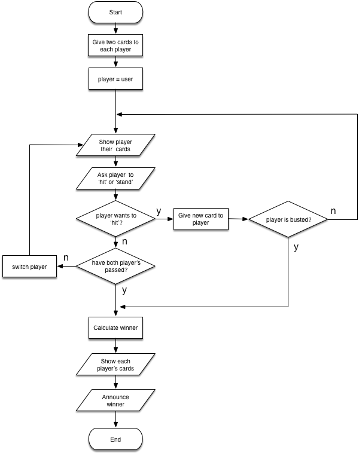

# Blackjack Exercise
A simplified version of the card game, [Blackjack](https://en.wikipedia.org/wiki/Blackjack).

## Structure of program

In our simplified version of Blackjack, the play unfolds as follows:

1. Two cards are dealt and displayed to the user.
1. Two cards are dealt to the dealer, but these are secret and not displayed to the user.
1. The user is prompted whether they would like an additional card (a "hit"). This question is repeated and the user may accept as many additional cards as they would like, until they respond with the words "stand", "stop", or "pass". If the value of the cards exceeds 21 at any point during this process of accepting cards, the user has "busted" and lost, and the game ends.
1. Assuming the user has not busted, once the user stops accepting new cards, the robotic dealer decides whether to accept as many additional cards as it wants. You can have the robot dealer do this at random if you like, or you can develop an artificial intelligence algorithm of your choosing. If the robot dealer's cards exceed 21 points during this process, the dealer has busted and lost, and the user wins.
1. Unless one of the players has busted, at the end of the game, if the user's cards are higher in total value than the dealer's cards, the user wins. Otherwise, the dealer wins.
1. Regardless of how the game ends, whether by a bust or by a win, the program must show the user what cards they had and what cards the dealer had at the end of the game and announce the result of the game (either there is a winner, a tie, or one of the players has bust.)

### Activity diagram

Game follows this activity diagram:

### Additional notes:

- All "cards" are simply integer values from 2 thru 11.

